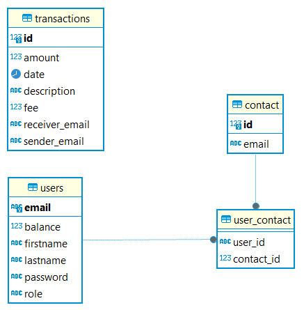

# Project Overview
"Pay My Buddy"
is a peer-to-peer payment application that allows users to easily send and receive money from their friends and family.
The application provides a secure platform for managing transactions, and contacts.
## Technical:

1. Spring Boot 3.3.2
2. Java 17
3. Thymeleaf
4. Bootstrap v5.3.3

## Getting Started

To get started with the application, follow these steps:

### Prerequisites
- Docker and Docker Compose installed on your machine
- Java JDK 11 or higher
- Maven

### Installation

1. Build the application:
```
    mvn clean install
```

2. Start the application with Docker Compose:
    - The spring-boot-docker-compose dependency will take care of starting the PostgreSQL database.
```
    mvn spring-boot:run
```

3. Access the application:
    - Open your browser and navigate to http://localhost:8080


4. Register a new user or log in with the following credentials:
   - username: test@test.com
   - password: test

## Test
To test the application and generate reports, follow these steps:

1. Run the unit tests and generate Surefire and Jacoco reports:
```
    mvn clean surefire-report:report jacoco:report -f pom.xml
```

2. Access the reports:
   - Surefire report: target/site/surefire-report.html
   - Jacoco report: target/site/jacoco/index.html


3. Manual testing:
    - Open the application in your browser.
    - Register a new user.
    - Log in with the registered user.
    - Add contacts and send transactions.
    - Verify the transaction history and account balance updates.

## UML Class Diagram

The UML Class Diagram represents the high-level design of the application's data model. It illustrates the relationships and attributes of the main entities involved in the system, including User, Account, Transaction, Contact, and Notification.


## Physical Data Model

The Physical Data Model defines the structure of the database tables required for the application. It outlines the relationships between entities and their respective attributes, providing a clear representation of the database schema.



## Table creation script

```sql
CREATE TABLE users (
    email VARCHAR(255) PRIMARY KEY,
    firstname VARCHAR(255) NOT NULL,
    lastname VARCHAR(255) NOT NULL,
    password VARCHAR(255) NOT NULL,
    role VARCHAR(255) NOT NULL,
    balance DOUBLE PRECISION DEFAULT 0
);

CREATE TABLE contact (
    id SERIAL PRIMARY KEY,
    email VARCHAR(255) NOT NULL,
    UNIQUE(email)
);

CREATE TABLE user_contact (
    user_id VARCHAR(255),
    contact_id INT,
    PRIMARY KEY (user_id, contact_id),
    FOREIGN KEY (user_id) REFERENCES users(email),
    FOREIGN KEY (contact_id) REFERENCES contact(id)
);

CREATE TABLE transactions (
    id SERIAL PRIMARY KEY,
    receiver_email VARCHAR(255),
    sender_email   VARCHAR(255),
    description VARCHAR(255),
    amount DOUBLE PRECISION NOT NULL,
    fee DOUBLE PRECISION NOT NULL,
    date TIMESTAMP(6) DEFAULT CURRENT_TIMESTAMP
);
```